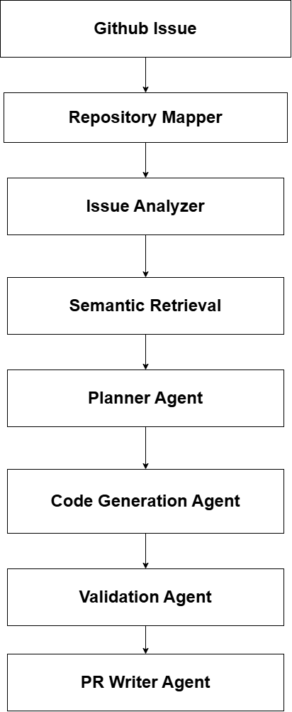

# PatchPilot 🚀

PatchPilot is an agentic AI framework designed to assist with solving issues in open-source Go repositories.

The system analyzes GitHub issues, understands repository structure, retrieves relevant code context, generates engineering plans, proposes code patches, runs the repository's Go test suite (`go test ./...`) as a validation harness, and drafts professional pull request summaries.

This project demonstrates repository-aware, multi-agent software-engineering workflows.

> **Scope & current limitations (by design):** PatchPilot is a focused demonstration, not a fully autonomous agent. Generated patches are *suggestions* — they are not auto-applied, so the Go test run establishes the repository's baseline test state rather than testing the patch itself. Code retrieval is lightweight lexical / term-frequency (TF) matching (vector embeddings are on the roadmap). Currently exercised against `spf13/cobra`.

---

# ✨ Features

* GitHub issue understanding using LLM reasoning
* Repository-aware code analysis
* Relevant Go file identification
* Lightweight lexical / term-frequency (TF) code retrieval
* Engineering planning agent
* Repository-aware code patch generation
* Go test-suite validation harness (`go test ./...`)
* Automated pull request summary generation
* Modular multi-agent architecture

---

# 🧩 Tech Stack

* Python
* OpenRouter API
* DeepSeek LLM
* GitPython
* Go Toolchain
* Requests
* BeautifulSoup


# 🧠 System Architecture




```
GitHub Issue
      ↓
Issue Analyzer Agent
      ↓
Repository Mapper Agent
      ↓
Lexical / TF Retrieval Layer
      ↓
Planner Agent
      ↓
Code Generation Agent
      ↓
Validation Agent
      ↓
PR Writer Agent
```

---


# 🤖 Agents

## 1. Issue Analyzer

Understands GitHub issues and extracts:

* problem summary
* affected modules
* testing considerations
* suggested fix directions

---

## 2. Repository Mapper

Scans Go repositories and identifies:

* relevant source files
* test files
* contextually important modules

---

## 3. Lexical / TF Retrieval Layer

Performs lightweight lexical / term-frequency (TF) retrieval across repository code to surface relevant files for the issue context. (Vector embeddings are planned — see Future Improvements.)

---

## 4. Planner Agent

Creates an engineering plan including:

* root cause analysis
* files to modify
* functions likely to change
* testing strategy
* risk assessment

---

## 5. Code Generation Agent

Generates focused Go patch suggestions using:

* repository context
* engineering plans
* retrieved code structure

---

## 6. Validation Agent

Runs:

```bash
go test ./...
```

against the target repository to establish its baseline test state. Generated patches are surfaced as suggestions and are not auto-applied — applying them and re-running tests is future work.

---

## 7. PR Writer Agent

Automatically generates:

* PR title
* PR description
* testing summary
* implementation notes

---

# 📂 Project Structure

```text
PatchPilot/
│
├── agents/
│   ├── issue_analyzer.py
│   ├── repo_mapper.py
│   ├── planner.py
│   ├── coder.py
│   ├── validator.py
│   └── pr_writer.py
│
├── tools/
│   ├── embedding_tool.py
│   ├── github_tool.py
│   ├── git_tool.py
│   ├── search_tool.py
│   └── test_runner.py
│
├── repositories/
│   └── cobra/
│
├── outputs/
│
├── memory/
│
├── prompts/
│
├── main.py
├── requirements.txt
└── README.md
```

# 📦 Supported Repositories

Currently tested with:

* spf13/cobra

The framework architecture is extensible and can support additional Go repositories with minimal changes.


---

# ⚙️ Setup Instructions

## 1. Clone Repository

```bash
git clone https://github.com/Divyansh-git10/PatchPilot.git
cd PatchPilot
```

---

## 2. Create Virtual Environment

```bash
python -m venv venv
```

Activate environment:

### Windows

```bash
venv\Scripts\activate
```

### Linux / Mac

```bash
source venv/bin/activate
```

---

## 3. Install Dependencies

```bash
pip install -r requirements.txt
```

---

## 4. Configure API Key

Create a `.env` file:

```env
OPENAI_API_KEY=your_openrouter_api_key
```

---

## 5. Install Go

PatchPilot uses real Go validation.

Verify installation:

```bash
go version
```

---

## 6. Clone Supported Repository

Example:

```bash
cd repositories
git clone https://github.com/spf13/cobra.git
cd ..
```

---

# ▶️ Running PatchPilot

```bash
python main.py
```

Example issue:

```text
https://github.com/spf13/cobra/issues/2259
```

---

# ✅ Example Workflow

PatchPilot performs:

1. GitHub issue analysis
2. Repository scanning
3. Relevant code retrieval
4. Engineering planning
5. Patch generation
6. Go test validation
7. PR summary generation

---

# 🧪 Validation

PatchPilot executes real Go repository tests:

```bash
go test ./...
```

Validation results are surfaced transparently, including:

* successful builds
* compilation failures
* test failures
* environment limitations

---

# 🛠️ Design Decisions

## Lightweight Retrieval

A lightweight lexical / term-frequency (TF) retrieval approach was used to keep the framework fast, portable, and dependency-light. Upgrading to vector embeddings is on the roadmap.

## Modular Agent Architecture

Each capability is separated into independent agents to improve extensibility and maintainability.

## Safe Patch Generation

The framework generates focused patch suggestions instead of blindly modifying repositories.

---

# 🚀 Future Improvements

* Transformer-based vector embeddings
* Automatic Git diff generation
* Repository graph understanding
* Multi-file coordinated patching
* Autonomous fix validation loops
* Dockerized execution environment
* Benchmarking against accepted PRs

---

# 📌 Notes

PatchPilot is intentionally designed as a focused and understandable framework rather than a fully autonomous production software engineering agent.

The goal is to demonstrate:

* repository reasoning
* agent orchestration
* retrieval-augmented engineering workflows
* safe code generation pipelines

---

# 📄 License

MIT License
